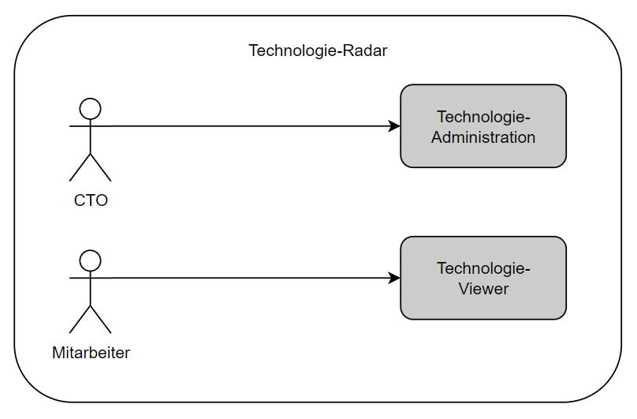
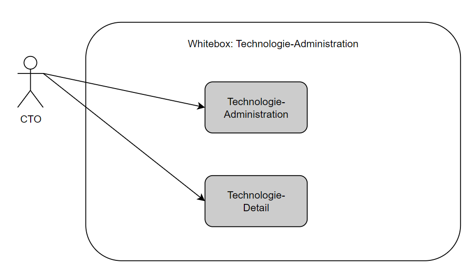
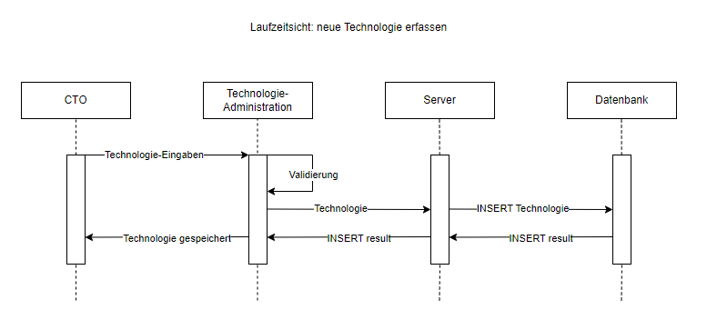

# Architekturdokumentation
Autor: Sven Bächler

## Lösungsstrategie
### Entwurfsentscheidungen
Die gesamte Lösung kann in folgende Komponenten aufgeteilt werden:
* Frontend (User Interface)
* Backend (Business-Logik)
* Datenbank

Das Frontend kommuniziert über eine REST-API mit dem Backend, welches die Daten in die Datenbank speichert / aus der Datenbank liest.

### Technologieentscheidungen
Das Frontent wurde in Form einer Angular App implementiert.

Das Backend wurde mit Node.js implementiert.

Die Datenbank ist eine MySQL Datenbank, welche während der Entwicklung in einem Docker-Container lief (siehe Anleitung Backend-Projekt).

## Bausteinsicht
### Scope & Context
Der CTO hat Zugriff zu der Technologie-Administration. Er kann Technologien erfassen, bearbeiten und publizieren.
Der Mitarbeiter hat jedoch nur Zugriff zum Technologie-Viewer, wo er alle publizierten Technologien sehen kann. Er kann keine Technologien bearbeiten.

### Level 1
Die Abbildung zeigt die Whitebox der Technologie-Administration. Der CTO hat hier Zugriff auf die Technologie-Administration, wo er eine Übersicht über alle Technologien hat. Über das Technologie-Detail kann er einzelne Technologien erfassen, bearbeiten oder publizieren.

## Laufzeitsicht
Die Abbildung zeigt die Laufzeitsicht des Szenarios "neue Technologie erfassen". Der CTO übermittelt die Eingaben an das Frontend (Technologie-Administration). Dieses Validiert die Eingaben und sendet die Technologie an den Server weiter, welcher ein INSERT INTO Statement an die Datenbank sendet. Das Result der Datenbank wird an das Frontend weitergeleitet, welches dem User die gespeicherte Technologie anzeigt.

## Verteilungssicht
Bis auf die MySQL Datenbank, welche in einem Docker Container läuft (siehe Anleitung Backend-Projekt), wurde die Applikation nicht weiter deployt.

## Querschnittliche Konzepte
Das Modell der Technologie zieht wird in der gesamten Applikation benötigt. Es wurde ein Interface definiert, welches die Eigenschaften einer Technologie beinhaltet:

    id: number;
    name: string;
    kategorie: Kategorie;
    ring: Ring;
    beschreibungTechnologie: string;
    beschreibungEinordnung: string | null;
    publiziert: boolean;
    publikationsDatum: Date | null;

In der Datenbank existieren zusätzlich folgende Felder:
* INS_TIME: Zeitstempel, wann die Technologie erfasst wurde
* UPD_TIME: Zeitstempel, wann die Technologie zuletzt bearbeitet wurde
* INS_USER: ID des Users, welcher die Technologie erfasst hat
* UPD_USER: ID des Users, welcher die Technologie zuletzt bearbeitet hat

## Architekturentscheidungen
### Routing
Das Routing wurde so konzipiert, dass für die Seite "neue Technologie erfassen" und "Technologie bearbeiten" die gleiche Komponente verwendet wird. Beim bearbeiten einer existierenden Technologie (mit der ID 5) lautet die Route `/administration/5`. Wird eine neue Technologie erfasst, lautet die Route `/administration/0`.
Je nach dem ob nun eine neue Technologie erfasst oder eine exisitierende Technologie bearbeitet wird, können die nötigen Bedienelemente in der Komponente ein- resp. ausgeblendet werden. Mit dieser Überlegung wurde im Frontend viel doppelter/redundanter Code vermieden.

Unter der Route `/administration` (ohne ID) ist die Administration aller Technologien hinterlegt.

Über die Route `/viewer` gelangt man als Mitarbeiter zum Technologie-Viewer, wo alle publizierten Technologien angezeigt werden.

### Speicherlogik Technologie-Detail
Auch bei der Speicherlogik der Technologie wurde eine Optimierung vorgenommen. Im Frontend gibt es nur eine Funktion, welche eine Technologie speichert. Neue Technologien erfassen und existierende Technologien zu bearbeiten laufen beide über die selbe Funktion, was wiederum redundanten Code vermeidet. Zusätzlich gibt es im Backend dementsprechend auch nur einen Endpoint für beide Use Cases.
Im Backend wird dann geprüft, ob die Technologie bereits existiert oder nicht (id=0 --> Technologie existiert noch nicht). Letztendlich wird nun die korrekte Funktion in der `databaseAccess` Klasse aufgerufen (`insertTechnologie` für neue Technologien, `updateTechnologie` für bereits existierende Technologien).

### Standalone Komponenten
Bei der Frontend-Applikation wurde von der Verwendung von Standalone-Komponenten abgsesehen. Es wurde das übersichtliche Prinzip verfolgt, pro Feature ein Modul zu generieren:
* Technologie-Administration
* Technologie-Detail
* Technologie-Viewer

Der Shared Ordner beinhaltet folgende Elemente:
* Enums
* Models
* Services
* Pipes

Das `PipesModule` ist ein shared Modul, welches bei Bedarf in andere Module importiert werden kann.

### Historisierung von Änderungen
Die Historisierung von Änderungen an Technologien ist mit dem Feld `UPD_TIME` und `UPD_USER` in der Datenbank geregelt. So ist für jede Technologie sichtbar, wann und von welchem User die Technologie zuletzt bearbeitet wurde.

### Anmeldung / Navigation
Da im Rahmen des Projektumfangs nicht jede Anforderung implementiert werden konnte, wurde entschieden, die Anmeldung zu vernachlässigen. Alle anderen Aspekte der Navigation wurden jedoch so implementiert, dass die Anmeldung im Nachhinein noch implementiert werden könnte.

Als Workaround wird auf dem Technologie-Viewer (Ansicht Mitarbeiter) ein Button angezeigt, mit welchem auf die Technologie-Administration (Ansicht CTO) navigiert werden kann. Dementsprechend kann von der Administration ebenfalls über ein Button wieder zurück zum Viewer gewechselt werden.
Bei der nachträglichen Implementierung der Anmeldung würde der Mitarbeiter lediglich den Technologie-Viewer, und der CTO die Technologie-Administration sowie die Technologie-Detail Seite zu Gesicht bekommen.

### Styling
Dem Styling wurde während dem Projekt eine geringe Aufmerksamkeit geschenkt, da der Fokus darauf lag, funktionierende Features zu implementieren. Es wurde das schlanke CSS-Framework pico verwendet.
